# Y2Kage

**A 16-bit first-person zombie horde shooter set on New Year's Eve 1999.** The Y2K bug is real, it turned the party into
a horde, and you have until midnight. Pick one of five 90s kids, each with their own ride and their own ridiculous
weapon, and hold out through 50 levels, one per minute from 11:10 PM, until the ball drops and the clocks roll over to 2000.

Built from scratch in Three.js. The city is real 3D geometry rendered at 384x216 and crushed to a dithered 16-bit
palette; everything you see (textures, zombies, weapons, the Windows 98 interface) is pixel art painted in code at boot.
Runs in any modern browser, supports online co-op for up to four players, and ships to iOS with Capacitor.

| | |
|---|---|
| 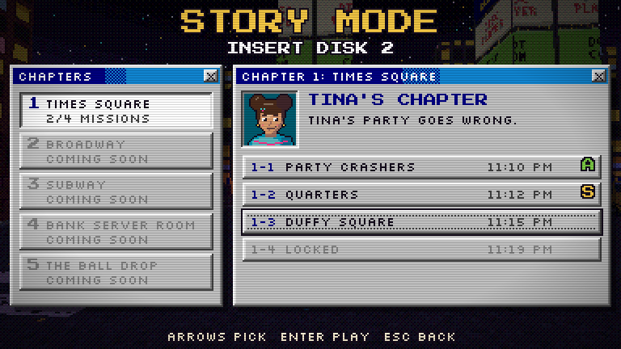 | 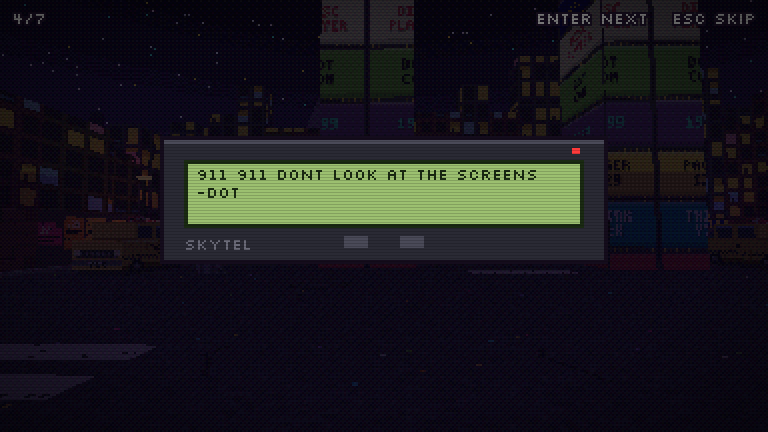 |
| 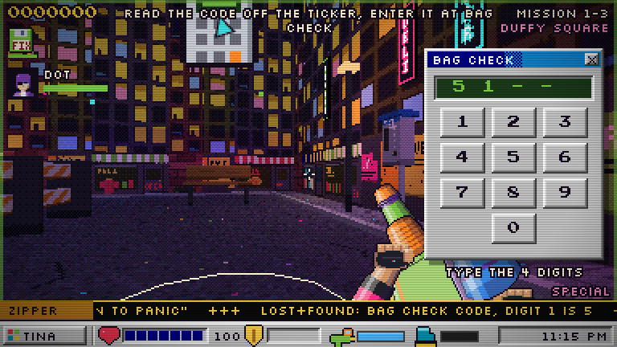 | 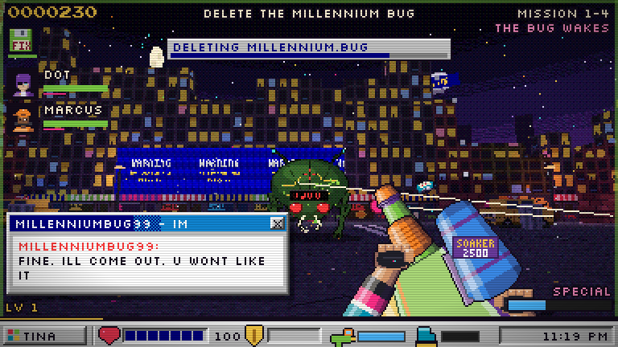 |
| 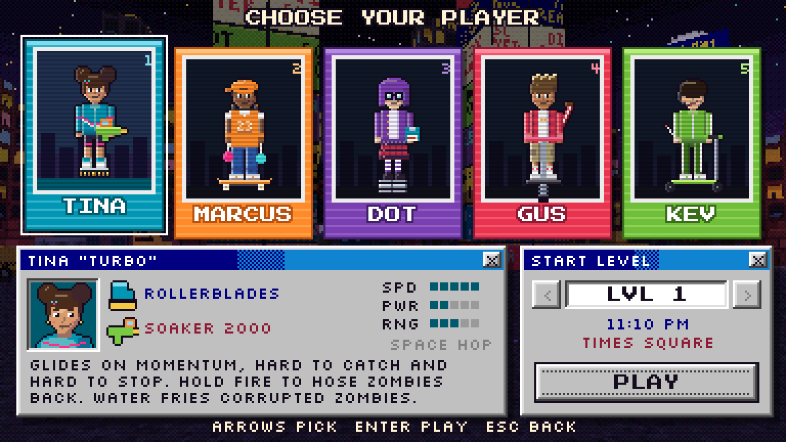 | 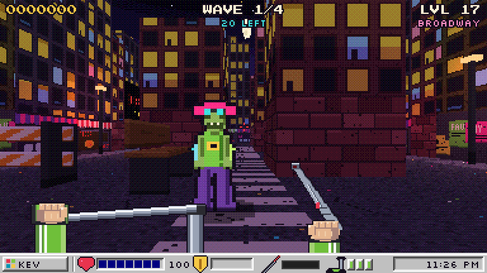 |
| 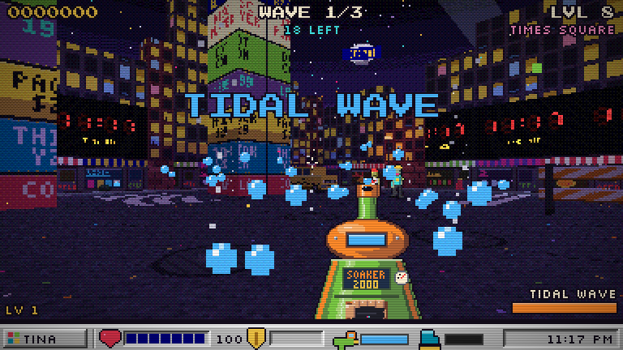 | 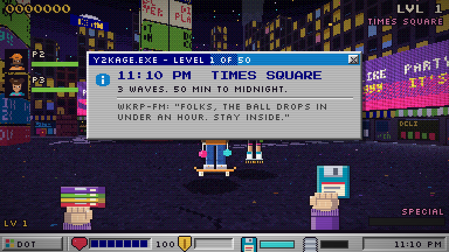 |
| 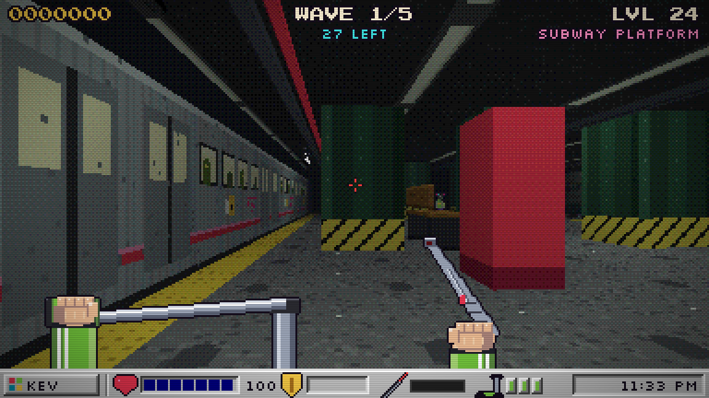 | 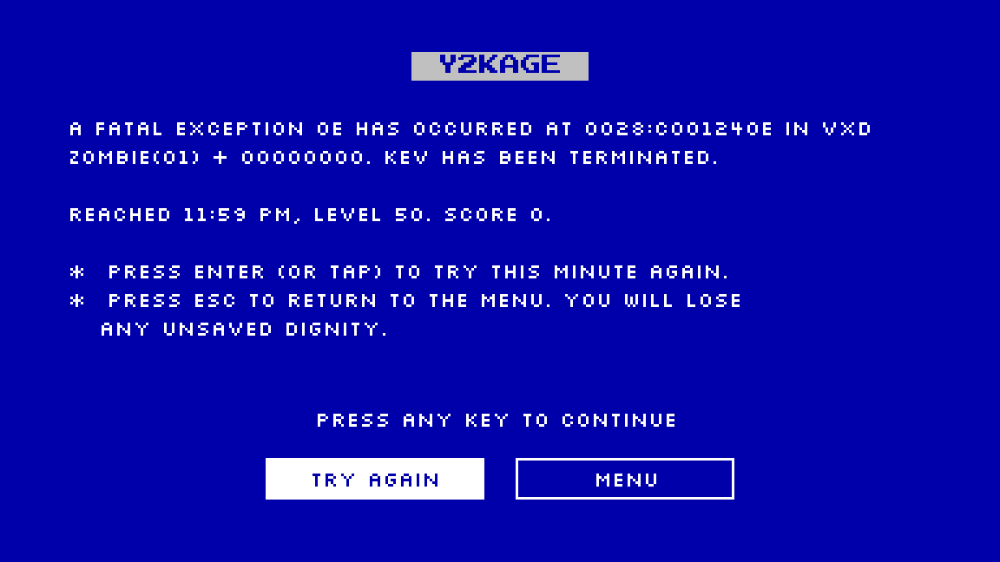 |
| 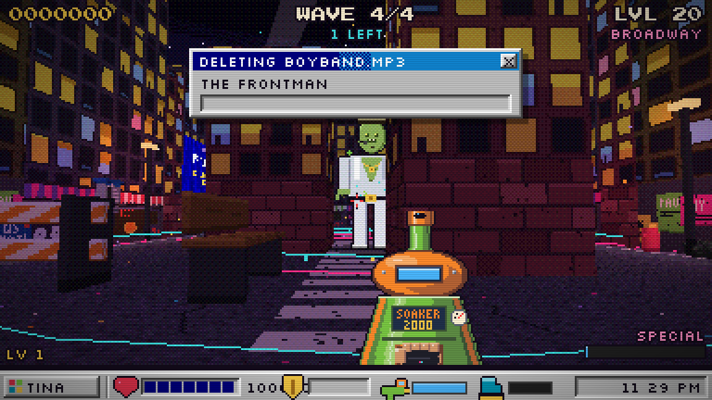 | 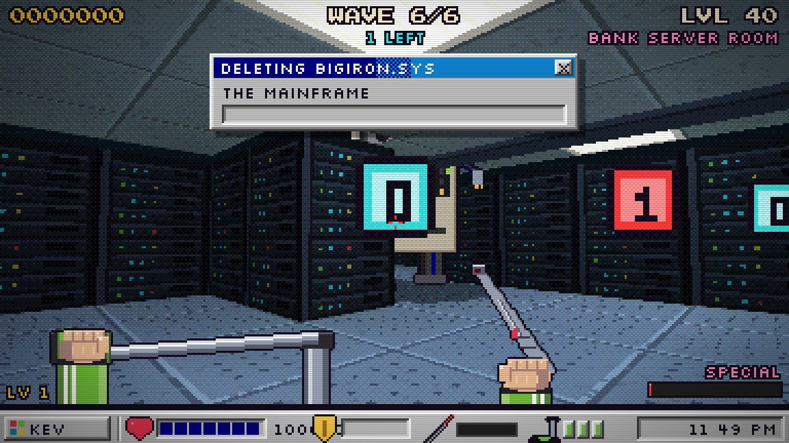 |
| 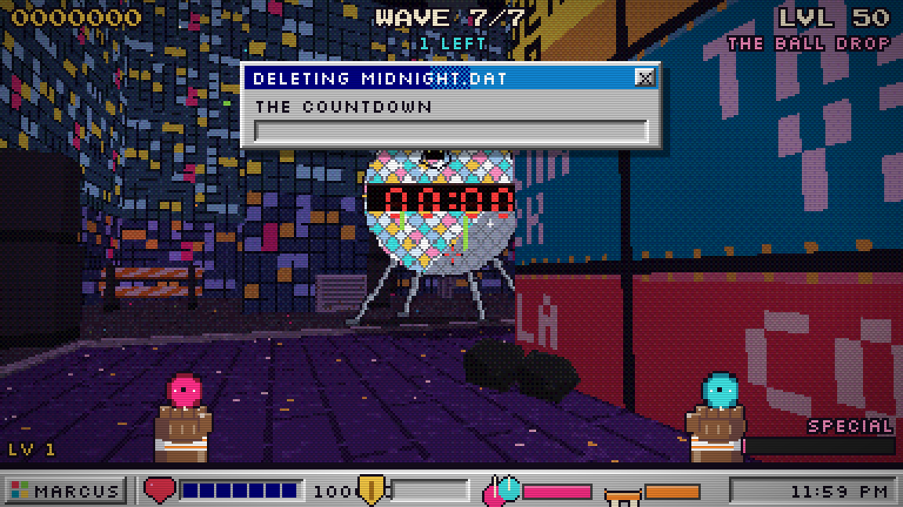 | 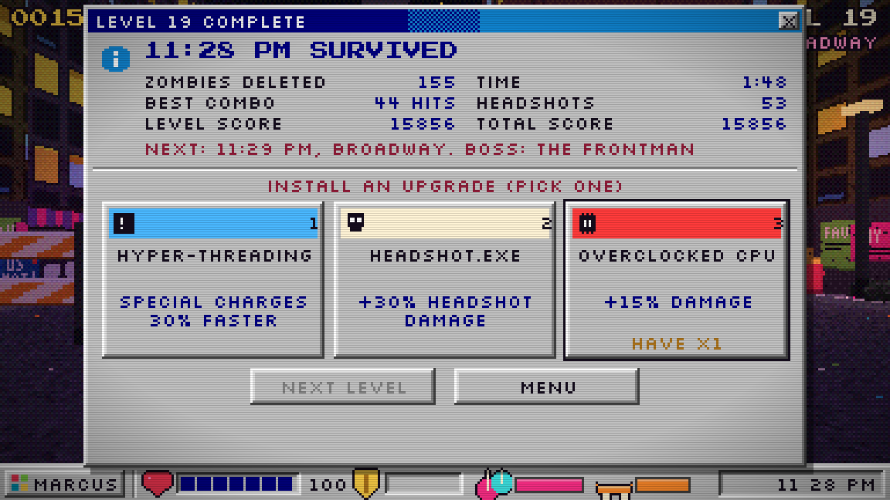 |
| 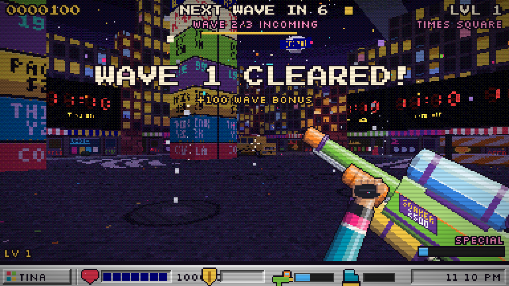 | 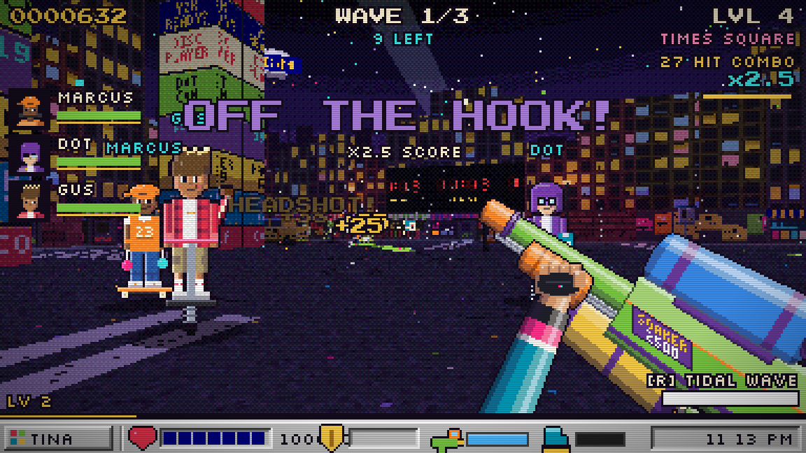 |

## Features

- **Story mode: "Insert Disk 2".** At 11:10 PM a program called MILLENNIUM.BUG wakes up in the bank's mainframe and
  starts turning anyone staring at a screen into a zombie. Dot has the only patch, on three floppies, and it has to go
  out from the Ball Drop antenna before midnight. Missions have objectives instead of waves: find fuses and quarters,
  fix a fuse box, call the theater from a payphone and hold the line, read a locker code off the news ticker and type
  it in, get Dot to the red steps, cut the Bug's power. The horde never stops coming. Cutscenes play out as TV news
  breaks, pager messages, AIM chats (the Bug types in lowercase) and the crew talking, and chapters have their own
  music that leans in when a fight starts. Chapter 1 (Times Square, four missions, Tina) is playable; chapters 2 to 5
  are designed in `docs/story-mode-design.md`.
- **50 levels, 5 districts, 5 bosses.** Level *n* takes place at 11:(09+*n*) PM on December 31, 1999. The district
  changes every ten levels, and each district ends in a fight with its own boss. Beat level 50 at 11:59 and the year
  rolls over.
- **Upgrades between levels.** Clear a level and install one of three random upgrades. Most are stat boosts that
  stack for the rest of the run; rare and legendary cards change how you play (chain lightning, exploding kills, a
  virus that spreads through the horde, a backup disk that cheats death). One free reroll per level.
- **Daily Challenge.** The Daily Bug Report is the same run for everyone on a given day: a set hero, district, twist
  (Big Head Mode, Moon Party, Overclocked, Swarm, Glass Cannon or Lucky Day) and two starting upgrades. Beat your best
  wave for the day and keep your streak of days played going.
- **No dead air.** Zombies close in from the streets around you as well as the map edges, and the last three of a
  wave hurry toward you with arrows pointing the way. Levels run about two minutes.
- **Every level is different.** Each district opens up as you go: new areas unlock on its 4th and 7th levels. Most
  levels roll an event (Rave in the Street, VIP Night, Blackout, Moon Party, Big Head Mode, Swarm, Gold Rush, Supply
  Drop, Glitch Storm or Stampede), never the same one twice in a district, and the 5th level of each district brings
  the Head Bouncer mini-boss. A new kind of zombie turns up on almost every one of the first eight levels.
- **Grades.** Every clear is graded S, A, B or C on how little you got hurt, how fast you cleared and how long your
  combos ran. Your best grade shows on the level picker, the first A on a level pays 15 tokens and the first S
  30 more, and an S on every level of a district earns the Honor Roll trophy.
- **Continue your run.** The campaign saves your upgrades and score at every level. Pick the same hero and level and
  PLAY becomes CONTINUE.
- **Hero cards.** Each hero has a rare upgrade card only they can draw: Slip 'n Slide (Tina's water slows zombies),
  Walk the Dog (Marcus's yo-yos hover at full reach), Disk Split (Dot's disks split on their first bounce), Cluster
  Bomb (Gus's blasts scatter bomblets) and Mirror Ball (Kev's beam bounces to another zombie).
- **Special zombies.** From level 3 some of the horde are special: green Spitters hang back and lob glitch globs,
  yellow Sprinters run you down, purple Tanks soak up punishment. They're worth 1.5x score.
- **Know where it hurts.** Red arrows around the crosshair point at whatever just hit you, and below 30% health the
  screen edges pulse with a heartbeat.
- **Boss checkpoints.** Die on a boss after reaching it and Try again starts straight at the boss wave.
- **Overdrive and the Jackpot.** Chain 20 kills to go into Overdrive (35% faster fire until the combo drops). Big
  kills freeze the frame for a beat. Once a level a golden Jackpot zombie turns up and runs for it: catch it for a
  big score prize, three pickups and a fistful of tokens.
- **Tokens and the Upgrade Shop.** Every level, boss, Jackpot and Endless wave pays out tokens. Spend them in the
  Shop on permanent perks: more health, extra rerolls, luckier cards, a head start on your special and free upgrades
  at the start of a run, and each hero's weapon upgrade.
- **Weapon upgrades.** Every weapon has a second tier in the Shop: Tina's green Soaker becomes a CPS 2500 (constant
  pressure), Marcus's yo-yos become orange Pro Yo-yos, Dot's floppies become CD-ROMs, Gus's bottle rocket tube
  becomes dual Roman candles firing coloured fireballs, and Kev's laser pointer becomes a laser tag gun.
- **Difficulty.** Easy, Normal or Hard in Options. Hard bites harder and brings more zombies but pays 1.5x tokens.
  The Daily Challenge is always Normal.
- **Trophies and unlockables.** 20 trophies. Beating bosses and other feats unlock Endless mode and cheats.
- **Endless mode.** Pick any district you have reached and survive as many waves as you can; its boss returns every
  fifth wave, and every third wave earns an upgrade pick (the Daily too). Your best wave per district is saved.
- **Gamepad support.** Plug in any standard controller (Xbox, PlayStation, Switch Pro) and play without the keyboard.
- **Five heroes, five rides, five weapons.** Every hero moves differently and shoots differently, and each has a
  special move that charges over time and with kills (R or right-click). Weapons point straight ahead and every shot leaves
  from the muzzle you see. Tina's two Soakers and Marcus's yo-yo hands are VS's own painted sprites (src/gfx/art/); she works the pump
  to build pressure back up.
- **Every weapon has a rhythm.** Tina's tank and Kev's heat meter were already there; Dot throws from a box of 12
  floppies (16 CDs) and Gus fires from a rack of 6 rockets (12 candle balls), then reloads. Reloading starts by itself
  when you run dry and between waves, or press X. `tools/dpsbench.mjs` holds fire for 20 seconds at a tough zombie and
  reports each weapon's real damage per second.
- **Melee.** Every hero carries two weapon slots, Doom style: 1 is their gun, 2 is melee. Swap with Q (or V, the mouse
  wheel, middle-click, 1 and 2, LB on a pad, HIT on touch): the weapon in hand drops out of view and the other comes up.
  With melee out, fire swings it and holding fire keeps swinging: a wind-up, a fast strike that connects as it crosses
  the middle of the screen (anything in the arc in front of you), a hit-stop and burst on contact, and a follow-through.
  Empty-handed you jab with your fists, alternating hands (Gus and Kev keep one hand on the bar). Bouncers and Tanks drop
  melee weapons that go straight into your hand until they break: a Louisville Slugger, a clicky PC keyboard, and a
  champagne bottle that goes off on its last swing; then you're back to your fists. Reload (X) with melee out brings the
  gun back and reloads it; a reload waits, half done, while the gun is put away. Specials bring the gun back too. CPU
  teammates swap to melee when something gets too close and back once there's room.
- **A 90s horde.** Party Shamblers, Ravers, Bouncers, Bloaters, Crawlers, CRT-headed Corrupted, and the Millennium Bug,
  dressed for whichever district you're in.
- **Headshots and combos.** Headshots deal double damage and pop heads off; chained kills build a score multiplier with
  90s call-outs.
- **Hero progression.** Each hero earns XP that persists between runs; every rank adds 4% damage. A first run through
  all 50 levels reaches about rank 40.
- **Powerups.** Y2K Patch (invincibility), Multitasking (triple, piercing shots), Screensaver (slow motion),
  Ctrl+Alt+Del (clears the screen) and Zip Disk (tops up everyone's weapon, 6 seconds of bottomless ammo).
- **CPU teammates.** Play offline with up to three computer-controlled heroes. They stick with you, keep their distance
  from the horde, pick their own upgrades and fire their specials into crowds.
- **Online co-op** for up to four players with room codes and join links.
- **The horde scales with the team.** Every extra player, human or CPU, adds 75% more zombies to each wave, 45% more on
  screen at once, and 50% more boss health.
- **Full Y2K presentation.** Power-on BIOS screen, 56k dial-up handshake, Windows 98 taskbar HUD with the countdown in
  the system tray, a Blue Screen of Death when you die, a chiptune soundtrack and an Auld Lang Syne ending.

## The bosses

| Levels | Boss | What it does |
|---|---|---|
| 10 | **The Millennium Bug** | Telegraphed bull charges. Sidestep when it roars. |
| 20 | **The Frontman** | A zombie boy-band lead. Sonic shockwaves roll along the street (jump or dash through them) and he calls in backup dancers. |
| 30 | **The Conductor** | Burrows under the platform, tunnels toward you and erupts under your feet. Keep moving when the ground turns red. Brings crawlers up from the tracks. |
| 40 | **The Mainframe** | A walking room-sized computer. Fires fans of data packets, teleports through static and spawns Corrupted. |
| 50 | **The Countdown** | The Times Square ball itself. Charges, shockwaves, packets and minions, all at once. |

Every boss gets faster below half health. From level 30 on, boss levels send two.

## Upgrades

After each cleared level, pick one of three. Each can stack up to five times.

| Upgrade | Effect |
|---|---|
| Overclocked CPU | +15% damage |
| Turbo Button | +15% fire rate |
| Fresh Wheels | +10% ride speed |
| Extra RAM | +25 max health |
| Surge Protector | Start levels with +40 armor |
| Defragmenter | Heal 1 health per second |
| Broadband | Grab pickups from further away |
| Lucky Floppy | +50% powerup drops |
| Hyper-Threading | Special charges 30% faster |
| HEADSHOT.EXE | +30% headshot damage |
| Call Waiting | Combos last 1 second longer |
| Volt Cola Tap | Heal 2 health per kill |
| Long Distance | Powerups last 40% longer |

Rare and legendary upgrades turn up more often deeper into the night:

| Upgrade | Rarity | Effect |
|---|---|---|
| Dial-Up Chain | Rare | Hits can arc to a nearby zombie |
| Lucky Pager | Rare | 10% chance of a 3x crit |
| Firewall | Rare | Zombies that bite you get fried and shoved back |
| Millennium Bomb | Legendary | Kills can blow up the crowd |
| ILOVEYOU.VBS | Legendary | Kills infect zombies nearby, who take damage over time |
| Backup Disk | Legendary | Survive one killing blow per level |

Retrying a level puts your upgrades back to how they were when it started. Quitting to the menu ends the run. In
online co-op every player picks their own.

## The Upgrade Shop

Tokens come from clearing levels (5 plus one per five levels, +20 for a boss level), catching the Jackpot (+10) and
Endless or Daily waves (2 each). Perks apply to your own hero only.

| Perk | Tiers | Effect per tier |
|---|---|---|
| RAM Upgrade | 40 / 80 / 160 | +10 max health |
| Better Modem | 60 / 150 | +1 reroll per level |
| Lucky Charm | 50 / 100 / 200 | Rare cards +3% (legendary +1%) |
| Power Surge | 50 / 120 | Special meter starts 25% full |
| Head Start | 100 / 250 | A random upgrade at the start of each run |

The Shop's last row is the weapon upgrade for the hero you have picked (150 tokens each). It works in co-op too: each
player brings their own tier.

| Hero | Upgrade | What changes |
|---|---|---|
| Tina | CPS 2500 | 12 damage a shot (from 8), faster and further spray, 150 tank |
| Marcus | Pro Yo-yos | 26 damage (from 18), faster throws, 8.5 reach |
| Dot | CD-ROMs | 32 damage (from 22), four ricochets, faster |
| Gus | Dual Roman candles | A fireball every 0.32s, alternating fists (was a rocket every 0.75s), smaller blasts |
| Kev | Laser tag gun | 105 damage a second (from 78), 22 reach, runs cooler, green beam |

## Trophies and extras

Open **Trophies** on the title screen to see them all. The ones that unlock something:

| Trophy | Unlocks |
|---|---|
| Bug Squashed (beat level 10) | **Endless mode**, on the hero select screen (TAB) |
| Encore Cancelled (beat level 20) | **Low Gravity** cheat |
| End of the Line (beat level 30) | **Confetti Goo** cheat |
| Pulled the Plug (beat level 40) | **Turbo Mode** cheat (whole game 25% faster) |
| Happy New Year (beat level 50) | **One Hit Wonder** cheat (everything dies in one hit, you too) |
| Head Hunter (25 headshot kills in a level) | **Big Heads** cheat |

Cheats are switched on and off in the Trophy Case. In co-op the host's cheats apply to everyone.

## The roster

| Hero | Ride | Weapon | Special |
|---|---|---|---|
| Tina | Rollerblades | Soaker 2500 | **Tidal Wave**: a firehose blast that shoves the whole street back |
| Marcus | Skateboard | Dual Yo-Yos | **Around the World**: both yo-yos orbit you for 6 seconds |
| Dot | Slinky Springs | Floppy Disks (ricochet) | **Defrag**: two rings of 24 floppies burst out and bounce everywhere |
| Gus | Pogo Stick | Bottle Rockets | **Grand Finale**: sixteen fireworks rain down around you |
| Kev | Kick Scooter | Laser Pointer | **Light Show**: six spinning beams cut through everything |

## Districts

| Levels | District |
|---|---|
| 1 to 10 | Times Square |
| 11 to 20 | Broadway |
| 21 to 30 | Subway Platform |
| 31 to 40 | Bank Server Room |
| 41 to 50 | The Ball Drop |

## Run it

```sh
npm install
npm run dev        # local dev server
npm run build      # production build into dist/
```

Add `?skip=title` to the URL to jump past the power-on, BIOS and dial-up intro.

## Headless playtests

`tools/playtest.mjs` runs the simulation in Node without drawing: a CPU hero plays the campaign from level 1 to 50,
retrying up to three times, and logs time, idle time (no zombie within reach), damage taken, rank and score per level.

```sh
HEROES=tina,gus SKILL=0.4 node tools/playtest.mjs   # SKILL 1 is the CPU teammate; lower plays more like a person
DIFF=hard FROM=1 TO=12 node tools/playtest.mjs      # easy, normal or hard
node tools/playtest.mjs > run.log && python3 tools/summ.py run.log             # one summary line per log
```

`tools/storyplay.mjs` plays every story mission with an autopilot that walks to each objective (fighting on the way,
holding USE at stations, typing the keypad code) and logs the result; `tools/storycheck.mjs` checks every story
coordinate is open floor the player can reach.

```sh
node tools/storycheck.mjs
ONLY=1-4 TRIES=5 node tools/storyplay.mjs
```

`tools/shot.mjs` takes screenshots of a `vite preview` build with Playwright.

## Put it online

`npm run build` makes a plain static site in `dist/` (relative paths, no server code). Any static host works:

- **itch.io**: zip the *contents* of `dist/` (so `index.html` is at the top of the zip), create a new project, set
  Kind to HTML, upload the zip, tick "This file will be played in the browser", and set the embed size to 1280x720 with
  the fullscreen button on. Share the page link.
- **GitHub Pages, Netlify, Cloudflare Pages**: publish the `dist/` folder as the site root.

## Online co-op

Up to four players, host plus three guests, over WebRTC (`src/net/net.js`, PeerJS). Online Co-op on the title screen:
the host gets a five-letter room code and a join link (`?join=CODE`); guests type the code or open the link. The host's
game runs the level and streams snapshots about 20 times a second; each guest moves themselves locally and sends their
position and actions. Waves grow 75% per extra player. A player who goes down reboots at the start of the next wave; the
level is lost only when everyone is down.

Matchmaking uses the free public PeerJS broker, and PeerJS's TURN relay covers strict NATs. For local testing without
internet, run a PeerJS server (`npx peerjs --port 9000`) and add `?peer=localhost:9000` to every player's URL.

## iOS

The Xcode project is in `ios/` (Capacitor, Swift Package Manager). On a Mac with Xcode:

```sh
npm run build
npx cap sync ios
npx cap open ios   # then run on a simulator or device from Xcode
```

The app is locked to landscape. Fonts are bundled so it works offline.

## How it looks 16-bit

- `src/gfx/pipeline.js` renders the scene into a 384x216 target with nearest filtering, then a post pass quantises
  each channel with a 4x4 Bayer dither, adds Y2K glitch tearing and damage flashes. The browser upscales with hard edges.
- `src/gfx/textures.js` paints every wall, floor, sky and prop skin at 32 texels per map unit.
- `src/ui/weapon.js` paints the first-person weapons as 2D pixel sprites over the world, in the style of Dot's
  floppies: flat textures skewed into the hero's fist (`src/gfx/model.js` has the Rig that shades tubes and slabs
  along a screen axis), each hero's own sleeve and hand, and a 1px ink outline. It draws both tiers of every weapon,
  works the Soaker's pump, and flashes each muzzle. Every weapon points straight ahead; the muzzle points live in
  `src/data/muzzles.js` and the sim spawns shots from the same spot in 3D.
- `src/gfx/bosses.js` draws the four district bosses after the Millennium Bug, their data packets and burrow mound.
- `src/gfx/sprites.js` draws the horde (party shamblers, ravers, bouncers, CRT-headed Corrupted, the Millennium Bug),
  projectiles, pickups, hero portraits and icons, all with 1px outlines.
- `src/world/world.js` turns each ASCII map into buildings, storefronts, jumbotrons, subway tile and server racks, with
  streetlamp, neon and fluorescent light baked into vertex colours.
- `src/ui/` is the Windows 98 layer: taskbar HUD with the countdown clock in the tray, dialog banners, the iMac-colour
  hero picker, the Blue Screen of Death, and "It's now safe to turn off your computer."
- `src/audio/` has the synthesised effects, a 56k dial-up handshake, and a chiptune player (pulse, triangle, noise).

## Layout

- `src/data/`   levels (50-level wave design, level n = 11:(09+n) PM, bosses, Endless), maps (one arena per district),
  heroes, upgrades, achievements (trophies, extras, cheats)
- `src/game/`   `game.js` (modes, flow, rendering each frame) and `sim.js` (rides, weapons, flow-field zombie AI, waves)
- Story mode: `src/data/story.js` (chapters, missions, objectives, cutscene lines), `src/game/mission.js` (runs a
  mission's objectives on top of the sim), `src/game/storymode.js` (chapter select, cutscenes, mission start and end),
  `src/ui/story.js` (its screens and HUD)
- `src/core/`   palette, pixel font (Press Start 2P and Silkscreen, thresholded to hard pixels), input, storage

## Controls

**Keyboard and mouse:** WASD move, arrows turn, mouse look up/down/around (click to lock); headshots do double
damage, legs 60%, click fire (or swing), Space and Shift for ride tricks, R or right-click for the hero's special once its
meter is full, Q, V, the wheel or middle-click swap between gun and melee (1 and 2 pick one), X reload (Dot and Gus),
P or Esc pause, M mute. In story mode, hold E to use things (fuse boxes, payphones, junction boxes) and type digits on
keypads (the number keys go to the keypad while it's open).

**Gamepad:** left stick moves, right stick aims, RT fires (or swings), X reloads, LB or R3 swap gun/melee, A jumps, B for the ride trick, Y or
RB for the special, Start pauses. In story mode, hold LT to use things and work keypads with the d-pad and LT. In menus the d-pad or left stick moves, A selects, B goes back, X switches between the
campaign and Endless on the hero select screen, and Y changes the number of CPU teammates.

**Hero select:** C (or the CPU button) cycles 0 to 3 CPU teammates; they play the next heroes along from yours.

**Touch:** left thumb moves, right thumb looks, with on-screen fire, jump, boost and HIT buttons (HIT swaps to melee and shows GUN to swap back).
